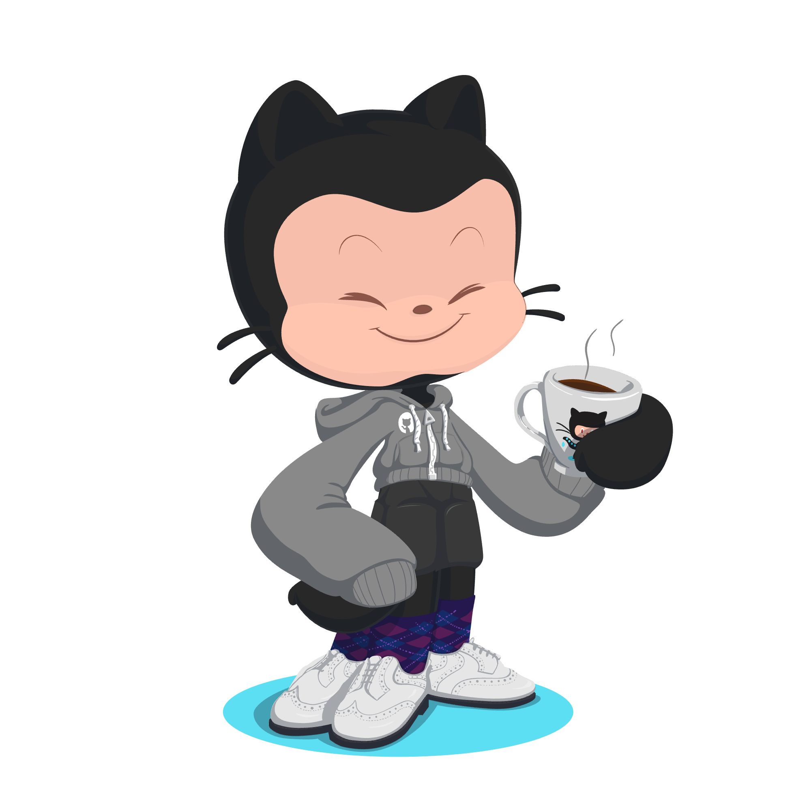

    

<h1 align="center">H ⓔ L ⓛ 0</h1>

    <em>Sometimes we build, sometimes we fix, sometimes we start over.</em>

    <strong>Tech Enthusiast · Fullstack Developer · Network & Systems</strong>

    

<strong>Indonesia 🇮🇩</strong>

I'm currently working on:

<strong>👉 Web Development</strong>

Ask me about anythink:

<strong>👉 andhikacndr15@gmail.com</strong>

Here's some stuff I mess around with

##### 📒 Languages

    
    
    

##### 🚀 Frameworks & Library

    
    
    
    
    
    
    

##### 📱 Mobile Framework

    

##### 👨 Social

    
    
    

